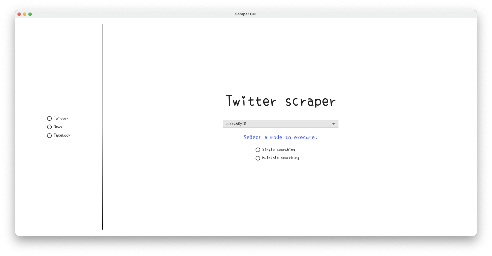
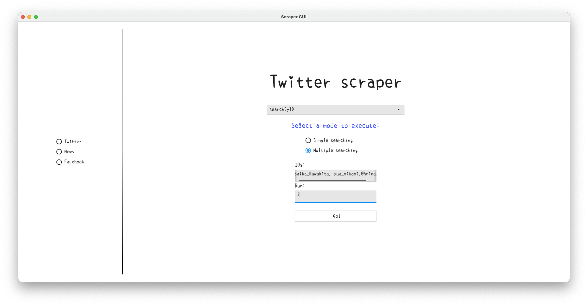

# Py_scraping projects&nbsp;&nbsp;&nbsp;&nbsp; Version:2.0.0 (Developing...)
- v1.0.0: pure python scraping
- v2.0.0: driven by golang(fyne)
---
## Twitter-scraping 
> scraping information from Twitter by using selenium  

Virtual environment: **Python 3.10.1** ( must be Python 3.10 up version because of the syntax issue )
To use the library, you will need a `.env` file under the `twitter-scraping` folder, elements within this file are as follows:
```
operateSystem=mac_ARM
#windows, mac_x86, mac_ARM

mail=your Twitter registered email
name=your Twitter account name
password=your Twitter password
output=output/
```

once you execute the main.go file, you should see a GUI interface as follows:


Select which mode to execute depends on your need:


Scraping would be started after pressing "Go!" button.
  
---
## Facebook-scraping
developing...

---
## News-scraping
developing...
   
# To-do list
twigui
 - ~~Build an interface for twitterGUI so that the code could be easier maintained.~~
 - ~~Python scraping for Twitter adding a new function to scrape the tweets by ID.~~
 - Keep developing twirobot package and integrating it with the current project.

 fbgui
 - Brainstorming

 newsgui
 - Brainstorming